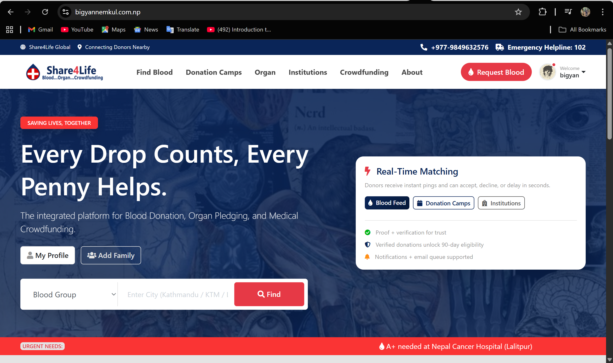
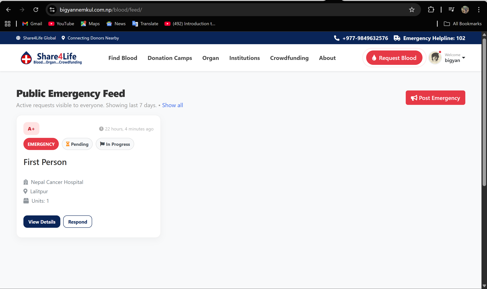
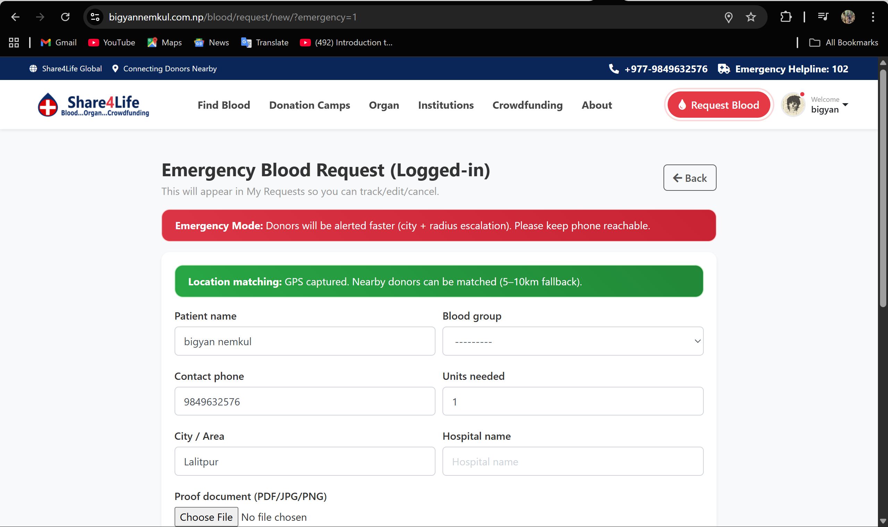
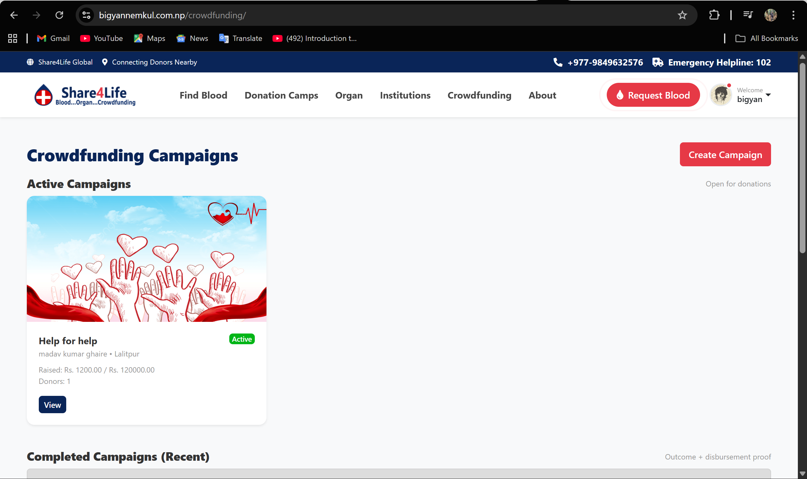
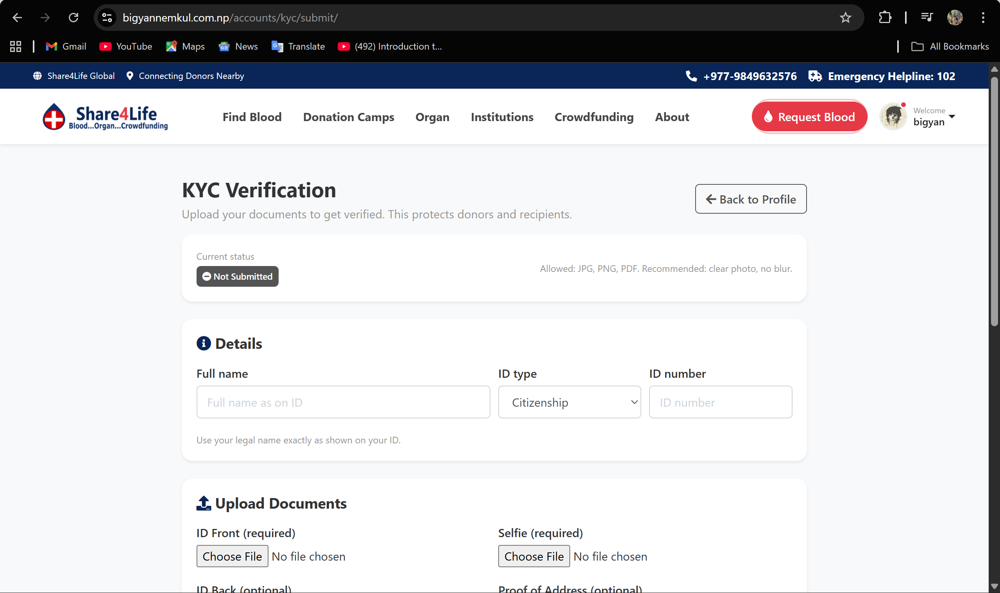
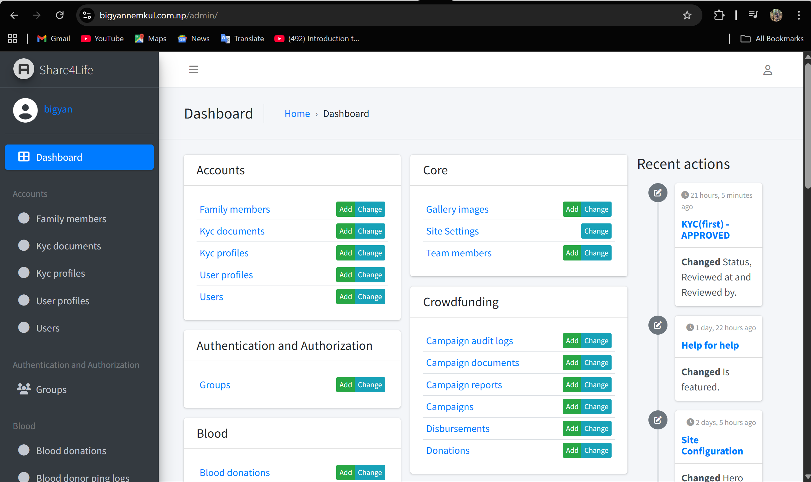
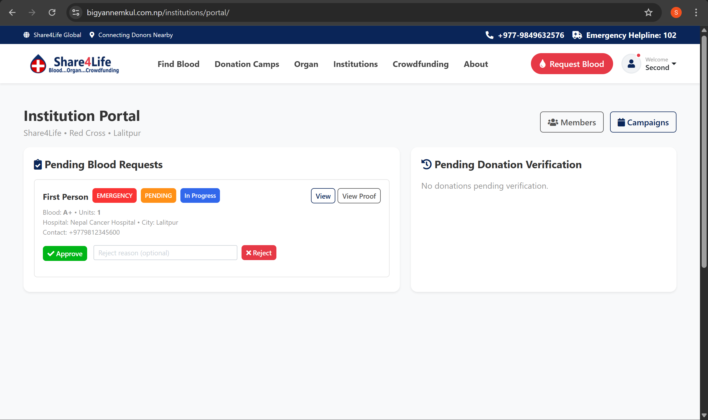

# Share4Life

**Share4Life** is a Django-based healthcare support platform designed to connect blood donors, recipients, hospitals, institutions, and crowdfunding campaigns in one unified system.  
It supports emergency blood requests, donor matching, organ pledging, verified crowdfunding, notifications, KYC verification, and institutional workflows.

---

## Table of Contents
- [Project Overview](#project-overview)
- [Key Features](#key-features)
- [Modules and Apps](#modules-and-apps)
- [Tech Stack](#tech-stack)
- [System Architecture](#system-architecture)
- [Deployment](#deployment)
- [Local Setup](#local-setup)
- [Environment Variables](#environment-variables)
- [Folder Structure](#folder-structure)
- [Core Workflows](#core-workflows)
- [Screenshots](#screenshots)
- [Limitations](#limitations)
- [Future Improvements](#future-improvements)
- [Acknowledgements](#acknowledgements)
- [License](#license)

---

## Project Overview

Share4Life is a full-stack web platform built to support emergency healthcare needs by enabling:

- blood donation requests and donor matching
- organ pledging and verification
- medical crowdfunding campaigns
- hospital/institutional verification
- real-time notifications and alerts
- donor eligibility tracking
- KYC verification and user trust features
- family member management for emergency support

The system is designed to reduce response time during emergencies and provide a centralized platform for donation and support services.

---

## Key Features

### User Management
- donor and recipient registration
- dual-role support (donor + recipient)
- login/logout
- email verification
- password reset
- profile management
- family member management
- emergency contact support

### Blood Donation System
- emergency blood requests
- public request feed
- donor accept / decline / delay response
- verified donation tracking
- 90-day eligibility logic
- donor history
- proof upload and verification
- hospital/institution verification

### Organ Donation System
- organ pledge creation
- organ request workflow
- document upload
- verification process
- donor/recipient support records

### Crowdfunding System
- campaign creation
- approval workflow
- donations through payment gateways
- campaign progress tracking
- public campaign list
- campaign status updates
- proof/disbursement tracking

### Notifications and Communication
- in-app notifications
- email notifications
- queued email sending
- emergency donor alerts
- institutional alerts
- real-time websocket-based donor pings

### Institutional Features
- hospital/organization registration
- institution approval workflow
- member assignment
- blood request verification
- donation verification
- campaign/camp management

### Trust and Verification
- KYC submission
- admin review
- profile completeness
- verified badges / access rules
- proof-based workflows

### Gamification and Impact
- points system
- certificates
- social impact tracking
- donation history
- recognition features

---

## Modules and Apps

The project is divided into multiple Django apps:

- **accounts** – user registration, login, profiles, KYC, family members
- **blood** – blood requests, donor responses, donation history, eligibility, real-time alerts
- **communication** – notifications, chat, email queue, messaging services
- **core** – homepage, site settings, shared utilities, public pages
- **crowdfunding** – campaigns, donations, disbursements, reports
- **hospitals** – organization registration, portal, campaign management
- **organ** – organ pledges and requests
- **templates** – shared templates and UI structure
- **static** – Bootstrap, CSS, JS, images

---

## Tech Stack

### Backend
- Python
- Django
- Django Channels
- Django REST Framework

### Database
- PostgreSQL (Neon in production)
- SQLite (local development fallback)

### Media and Storage
- Cloudinary

### Realtime and Queue
- Redis
- WebSockets
- queued email processing

### Deployment
- Render
- GitHub Actions (scheduler/automation)

### Frontend
- Bootstrap
- HTML
- CSS
- JavaScript
- jQuery

---

## System Architecture

Share4Life follows a modular Django architecture:

- **frontend layer**: Django templates + Bootstrap UI
- **business logic layer**: views, services, signals, management commands
- **data layer**: PostgreSQL / SQLite models
- **background layer**: scheduler, email queues, escalation commands
- **realtime layer**: WebSockets and donor pings
- **storage layer**: Cloudinary for images/documents

---

## Deployment

### Production Stack
- Render web service
- Neon PostgreSQL
- Cloudinary for media
- Brevo API for transactional emails
- GitHub Actions scheduler for periodic tasks

### Production Notes
- Free-tier deployment may experience cold-start delays.
- Scheduler and queued tasks are used for reminders and points recalculation.
- Redis channel layer can be disabled on free tier for stability.

---

## Local Setup

### 1. Clone the repository

git clone https://github.com/ChakuHo/Share4Life.git
cd Share4Life

### 2. Create Virtual Environment
python -m venv .venv
source .venv/bin/activate   # Linux/macOS
.venv\Scripts\activate      # Windows

### 3. Install Dependencies
pip install -r requirements.txt

### 4. Set Environment Variables
Create a .env file or set environment variables in your system.

### 5. Run Migrations
python manage.py migrate

### 6. Create Superuser
python manage.py createsuperuser

### 7. Run Development Server
python manage.py runserver


## Environment Variables

Example variables used by the project:

SECRET_KEY=your-secret-key
DEBUG=0
ALLOWED_HOSTS=yourdomain.com,localhost,127.0.0.1
CSRF_TRUSTED_ORIGINS=https://yourdomain.com

DATABASE_URL=your-postgres-url
DB_SSL_REQUIRE=1

CLOUDINARY_URL=your-cloudinary-url

SITE_BASE_URL=https://yourdomain.com

EMAIL_HOST_USER=your-email@example.com
EMAIL_HOST_PASSWORD=your-email-password
DEFAULT_FROM_EMAIL=Share4Life <your-email@example.com>

BREVO_API_KEY=your-brevo-api-key
EMAIL_TIMEOUT=10

REDIS_URL=your-redis-url
USE_REDIS_CHANNEL_LAYER=0

RECAPTCHA_SITE_KEY=your-site-key
RECAPTCHA_SECRET_KEY=your-secret-key

KHALTI_PUBLIC_KEY=your-khalti-public-key
KHALTI_SECRET_KEY=your-khalti-secret-key
KHALTI_WEBSITE_URL=https://yourdomain.com

ESEWA_PRODUCT_CODE=EPAYTEST
ESEWA_SECRET_KEY=your-esewa-secret
ESEWA_FORM_URL=https://rc-epay.esewa.com.np/api/epay/main/v2/form

## Folder Structure

```
share4life/
├── .github/
├── .gitignore
├── README.md
├── LICENSE
├── manage.py
├── requirements.txt
├── Pipfile
├── Pipfile.lock
├── accounts/
├── blood/
├── communication/
├── config/
├── core/
├── crowdfunding/
├── hospitals/
├── organ/
├── static/
├── templates/
├── media/
└── docs/
    └── screenshots/
```


## Core Workflows

1. Registration and Verification
user registers
email verification is sent
user completes profile and KYC
verified users gain access to more features

2. Blood Request Flow
recipient creates urgent or normal blood request
donors are matched based on blood group and city
donors can accept / decline / delay
donors can later record donation
institution can verify donation

3. Organ Donation Flow
donor submits pledge
admin/institution reviews documents
pledge is approved or rejected

4. Crowdfunding Flow
user creates campaign
admin approves campaign
donations are made through payment gateway
campaign progress updates automatically

5. Notification Flow
request or campaign updates generate notifications
queued emails are processed by scheduler
real-time donor pings are handled through websockets


## Screenshots










## Limitations

- Free-tier hosting may cause cold-start delays
- Some websocket features depend on runtime configuration
- Email delivery depends on external provider availability
- Real-time escalation may be slower on inactive instances

## Future Improvements

- mobile app integration
- SMS / WhatsApp integration
- AI-based donor matching
- map-based donor proximity
- better analytics dashboard
- push notifications
- multilingual interface
- advanced hospital management module


## Acknowledgements

Special thanks to:

- Django community
- Render
- Neon
- Cloudinary
- Brevo
- Bootstrap
- open-source contributors


## License

This project is created for academic/final year project purposes.

All rights reserved. No part of this project may be copied, modified, or redistributed without the author's permission.
